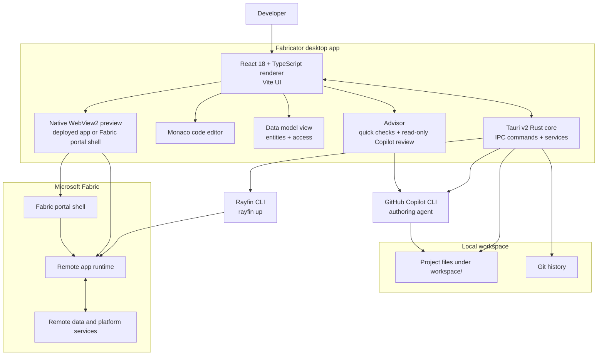

# Contributing to Fabricator

Thanks for your interest in contributing to Fabricator. This is a personal, free-time project maintained by Sachin Patney (GitHub [@spatney](https://github.com/spatney)). The author works at Microsoft, but this is **not** a Microsoft product and is not affiliated with, endorsed by, or supported by Microsoft. Maintenance is best-effort.

Repository: https://github.com/spatney/rayfin-fabricator

## What this project is

Fabricator is a desktop app for Windows and macOS (Apple Silicon) for building "Rayfin apps" via chat. It uses Tauri v2 with a Rust backend and a React 18 + TypeScript renderer built with Vite. It wraps the GitHub Copilot CLI for authoring and the Rayfin CLI (`rayfin up`) for deployment to Microsoft Fabric.

You author locally. Fabricator automatically manages a local Vite frontend preview during chat turns when the project has Vite installed, using the existing Fabric backend. Deployment and backend validation still target Microsoft Fabric; projects without local Vite keep the deployed preview.

## Prerequisites

| Requirement | Notes |
| --- | --- |
| Windows 10/11 or macOS | Windows uses the WebView2 runtime; macOS uses the system WebKit. macOS builds target Apple Silicon (arm64). |
| Node.js 20+ and npm | For the renderer and build scripts. |
| Rust stable | Windows: the MSVC toolchain. macOS: the default toolchain plus the Xcode command-line tools. |
| Tauri prerequisites | For local desktop development and packaging. |
| Git | Used for local project history. |

You don't need to install the Rayfin CLI or the GitHub Copilot CLI. Each Rayfin project pins its own Rayfin CLI, which Fabricator runs through `npx rayfin`, and the Copilot engine is bundled with the app; you sign in to both from inside Fabricator.

## Development setup

1. Clone the repository.
2. Install dependencies with `npm ci`.
3. Start the app with `npm run dev`.

## Useful scripts

| Script | What it does |
| --- | --- |
| `npm run dev` | Runs the Tauri app with the Vite renderer. |
| `npm run build` | Builds the desktop app and its installer (NSIS `.exe` on Windows, `.dmg` and updater bundle on macOS). |
| `npm run dev:renderer` | Runs the renderer development server. |
| `npm run build:renderer` | Builds the renderer. |
| `npm run typecheck` | Runs TypeScript type checking. |
| `npm test` | Runs renderer regression tests (also run in CI). |
| `npm run lint` | Runs lint checks. |
| `npm run format` | Formats code with Prettier. |

## Verification before opening a PR

Please run:

```powershell
npm run typecheck
npm run lint
npm run build:renderer
```

If you changed Rust code, also run Cargo from `src-tauri`:

```powershell
cd src-tauri
& "$env:USERPROFILE\.cargo\bin\cargo.exe" check
```

Cargo may not be on `PATH`, so the explicit path above is often safest on Windows.

## Project layout

```text
rayfin-fabricator/
├─ src-tauri/                 Rust Tauri backend, IPC commands, services, resources, packaging
│  ├─ src/commands/           IPC handlers: advisor, auth, chat, deploy, design, doctor, fabric, files, git, projects, settings, team, …
│  ├─ src/services/           exec, preview, store, telemetry, history, crashlog, emit, paths, team, …
│  └─ vendor/wry/             Vendored wry: WebView2 device-compliance SSO patch + macOS preview-positioning fix
├─ src/renderer/              React 18 + TypeScript UI built with Vite
│  ├─ screens/                SetupScreen onboarding and Workbench shell
│  └─ components/             ChatPanel, PreviewPane, CodeViewer, DeploymentsControl, AdvisorView, GitControl, SettingsModal, …
├─ src/shared/ipc.ts          Shared TypeScript IPC types
├─ src/shared/advisor/        Advisor rule catalog (rules.json), shared by the renderer and the Rust core
├─ src/shared/docs-links.json Docs pages the app links to (checked by the docs build)
├─ website/                   Documentation site (Next.js + Fumadocs), published to GitHub Pages
├─ scripts/docs-screenshots/  Tooling that captures the docs site's screenshots
├─ scripts/intro-video/       The landing page's intro video: Remotion scenes with Ray and ElevenLabs audio
├─ docs/                      Maintainer deployment notes and the vendored wry patch write-up
├─ analytics/                 Application Insights KQL queries and notes
├─ resources/                 Runtime resources, including telemetry configuration placeholders
├─ .github/workflows/         CI, the release workflow (Windows NSIS and macOS dmg builds), and the docs site deploy
├─ package.json               npm scripts and renderer dependencies
└─ logo.png                   Project logo
```

The vendored `wry` patch is documented in [`docs/VENDORED-WRY-PATCH.md`](./docs/VENDORED-WRY-PATCH.md). It enables WebView2 device-compliance SSO so the embedded preview can sign in to Entra Conditional Access "compliant device" apps.

## Architecture



A React renderer drives the workbench, chat, editor, data model view, preview, deployments, advisor, settings, skills, and history. A Tauri v2 Rust core owns the IPC handlers in `src-tauri/src/commands/` and the services in `src-tauri/src/services/` for running external tools, persistence, preview hosting, telemetry, history, crash logs, auto-updates, and path management.

Fabricator wraps the tools you'd otherwise run by hand. It shells out to the GitHub Copilot CLI to author and to the Rayfin CLI to deploy, tracks your project with git, and loads the running app — deployed to Microsoft Fabric — into the embedded preview. The Advisor closes the loop: instant rule checks plus an on-demand, read-only Copilot review flag issues like unguarded routes, loose database policies, or unbounded text columns, and it tells you when a review has gone stale.

## Documentation site

The user docs at <https://spatney.github.io/rayfin-fabricator/> are built from [`website/`](./website) (Next.js + Fumadocs, static export). `.github/workflows/docs.yml` builds it on pull requests and publishes it to GitHub Pages on every push to `master` that touches the site.

```powershell
cd website
npm install
npm run dev          # http://localhost:3000
npm run check:docs   # content lint
```

- Pages are MDX files in `website/content/docs/`. Read [`website/AGENTS.md`](./website/AGENTS.md), the authoring contract, before writing one.
- Update the docs in the same pull request when you change behavior, setup, UI labels, or messages users see.
- The app links to specific docs pages and headings through `src/shared/docs-links.json`. `npm run verify:app-links` (run by the docs workflow after a build) fails if one of them disappears, so rename a linked page or heading together with that file.
- Screenshots live in `website/public/screenshots/`. Refresh them with the tooling in [`scripts/docs-screenshots/`](./scripts/docs-screenshots/README.md), which runs an isolated copy of the app and removes personal details.
- The landing page's intro video, hosted by Ray, is generated by [`scripts/intro-video/`](./scripts/intro-video/README.md). Render and publish it again after UI changes that show up in it.

## Coding conventions

- Keep changes focused and surgical.
- Use TypeScript with the existing ESLint and Prettier setup.
- Run `npm run format` for formatting.
- Rust code uses 2-space indentation.
- Do not include secrets in source code.

## Commit and PR conventions

- Commit messages should be concise, imperative, sentence-case, and have no type prefix.
- Open PRs against https://github.com/spatney/rayfin-fabricator.
- Link related issues where possible.
- Include screenshots or notes for UI changes.
- Update the docs site (`website/content/docs/`) when behavior, setup, or release steps change.

## Vendored wry patch

The vendored `wry` crate includes a one-line WebView2 device-compliance SSO patch. If Tauri is upgraded and brings in a new `wry`, the patch must be re-applied. See `docs/VENDORED-WRY-PATCH.md` before changing Tauri or `wry`.

## Releases

Pushing a version tag drives `.github/workflows/release.yml`. The release workflow builds the NSIS installer and injects the Application Insights connection string from the `APPINSIGHTS_CONNECTION_STRING` GitHub Actions secret into `resources/telemetry.json` at build time.

`deploy.ps1` is a maintainer-only script that provisions Azure Application Insights and sets that secret.

### Code signing (maintainers)

Release installers are signed with **Azure Trusted Signing** (a.k.a. Azure Artifact Signing) when the required GitHub Actions settings are present. The release workflow signs both the app executable and the NSIS installer through Tauri's `signCommand` and [`artifact-signing-cli`](https://github.com/Levminer/trusted-signing-cli). When the signing credentials are absent (forks, PR builds), the installer is still produced — just unsigned — so contributors never need a certificate to build.

To enable signing, set the following on the repository (**Settings → Secrets and variables → Actions**):

| Kind | Name | Value |
| --- | --- | --- |
| Secret | `AZURE_SIGNING_CLIENT_ID` | App registration (client) ID |
| Secret | `AZURE_SIGNING_CLIENT_SECRET` | App registration client secret |
| Secret | `AZURE_SIGNING_TENANT_ID` | Directory (tenant) ID |
| Variable | `AZURE_SIGNING_ENDPOINT` | Region endpoint, e.g. `https://eus.codesigning.azure.net` |
| Variable | `AZURE_SIGNING_ACCOUNT` | Trusted Signing account name |
| Variable | `AZURE_SIGNING_CERT_PROFILE` | Certificate profile name |

The app registration's service principal needs the **Artifact Signing Certificate Profile Signer** role on the signing account. Signing removes the "Unknown Publisher" prompt immediately; Microsoft SmartScreen still builds per-certificate reputation over time, so brand-new releases may show a SmartScreen prompt until enough downloads accrue.

## Issues and pull requests

Please file issues and pull requests at https://github.com/spatney/rayfin-fabricator.
