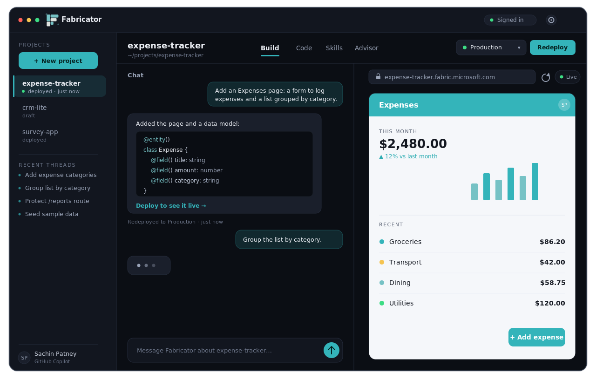
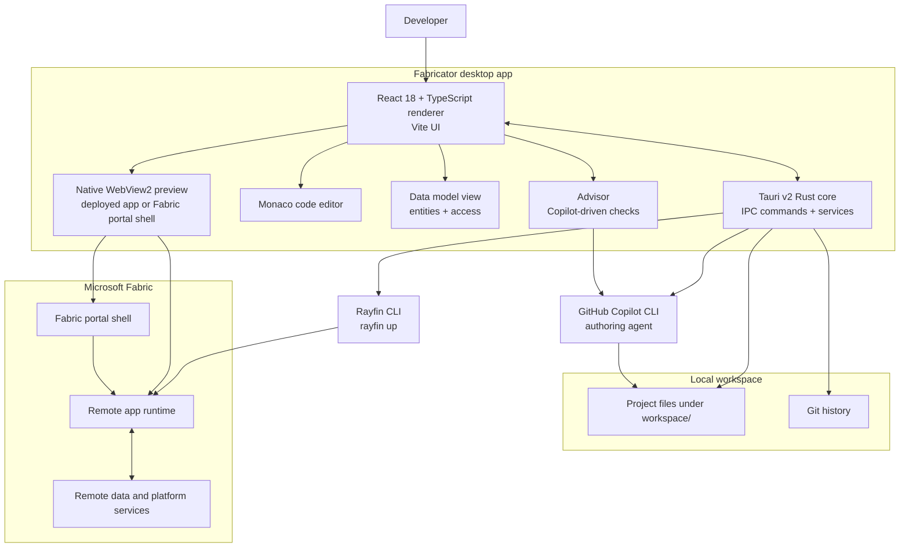

<div align="center">
  

  <h1>Fabricator</h1>

  <p><strong>The all-in-one workbench for building Rayfin apps — chat to build, preview inline, and ship to Microsoft Fabric, all in one window. No CLI wrangling, no new account: just your GitHub Copilot sign-in.</strong></p>

  <p>
    <a href="https://github.com/spatney/rayfin-fabricator/releases/latest"></a>
  </p>

  <p>
    <a href="./LICENSE"></a>
    
    
  </p>
</div>

<div align="center">
  <a href="https://github.com/spatney/rayfin-fabricator/releases/latest">
    
  </a>
  <p><sub>Build, preview, and ship — all in one window. <em>(Representative UI.)</em></sub></p>
</div>

> **Personal project disclaimer**
> Fabricator is a personal project built by Sachin Patney in his own free time. The author works at Microsoft, but this is not a Microsoft product and is not affiliated with, endorsed by, sponsored by, or supported by Microsoft.

Building a Rayfin app usually means living in your terminal: scaffold with one CLI, prompt the Copilot CLI, run `rayfin up` to deploy, wrangle git, flip to a browser to check it, repeat. Fabricator folds all of that into a single desktop app.

You chat, the app gets built, you watch it come together inline, and you manage every deployment from one panel. No commands to memorize, no terminal tabs to juggle.

Best of all, it runs on the **GitHub Copilot account you already have**. Nothing new to sign up for and no extra subscription — sign in and start building.

### New to Rayfin?

Rayfin is Microsoft's **Backend-as-a-Service for the agentic era**. You define your data model with TypeScript decorators and the platform provisions and manages the database, authentication, data APIs, storage, and hosting for you — all on Microsoft Fabric, with enterprise-grade governance built in. Learn more at [microsoft/rayfin](https://github.com/microsoft/rayfin) and the [Rayfin docs](https://aka.ms/rayfin/docs).

Fabricator is the desktop shell that makes building those apps effortless.

## Everything in one window

1. **Chat to build.** Describe what you want in plain English. The built-in GitHub Copilot agent writes and edits the project files for you — you never touch a command line. Git quietly snapshots every change, so you can diff and roll back anytime.
2. **See it as it's built.** Inspect and edit any file in a built-in Monaco editor, and watch the app itself in a live inline preview — no separate browser, no copy-pasting URLs.
3. **Deploy with a click.** Hit deploy and Fabricator runs `rayfin up` for you, shipping the app to Microsoft Fabric. Create, switch, and redeploy across workspaces from a single deployments panel.
4. **Harden it.** The Advisor runs Copilot-driven security and policy checks — unprotected routes, over-permissive database policies, that kind of thing — and flags them when the project changes.
5. **Repeat** until it's exactly what you wanted.

## Download

Fabricator runs on **Windows 10/11** and **macOS (Apple Silicon)**.

> **[⬇️ Download the latest release](https://github.com/spatney/rayfin-fabricator/releases/latest)**

**Windows**

1. Grab the `Rayfin Fabricator_<version>_x64-setup.exe` asset from the [latest release](https://github.com/spatney/rayfin-fabricator/releases/latest), or browse every build on the [Releases](https://github.com/spatney/rayfin-fabricator/releases) page.
2. Run it. The installer is Authenticode code-signed (via Azure Artifact Signing) and shows a verified publisher, *Sachin Patney*. SmartScreen reputation builds per certificate over time, so an early download may still warn you — if it does, choose **More info → Run anyway**.

**macOS (Apple Silicon)**

1. Grab the `Rayfin Fabricator_<version>_aarch64.dmg` asset from the [latest release](https://github.com/spatney/rayfin-fabricator/releases/latest), open it, and drag the app into **Applications**.
2. The macOS build is ad-hoc signed but not yet notarized by Apple, so macOS quarantines it on download. Clear the quarantine flag once from Terminal, then open the app normally:

   ```bash
   xattr -dr com.apple.quarantine "/Applications/Rayfin Fabricator.app"
   ```

   > This is a one-time step. Without it macOS may report the app as *"damaged and can't be opened"* — that's the quarantine flag, not real corruption. (Control-click → **Open** also works, but the `xattr` command is the most reliable.) These steps go away once the app is notarized.

Then launch the app. The onboarding doctor checks the rest and walks you through signing in to GitHub Copilot and Microsoft Fabric.

To build apps you'll create a Rayfin project with `npm create @microsoft/rayfin@latest`. Fabricator uses that project's pinned Rayfin CLI, so there's nothing to install globally. The app keeps itself up to date with in-app auto-updates on both platforms.

Want to build from source instead? Jump to [Build from source](#build-from-source).

## What's inside

**Author.** Chat with a built-in GitHub Copilot agent in **Agent**, **Plan**, or **Autopilot** mode — pick the model and reasoning effort, steer it mid-turn, and keep separate threads (plus optional parallel side threads) with full history. Inspect and edit any generated file in a built-in Monaco editor, see your data model as an entity diagram, browse the agent's reusable Skills, and lean on a git timeline you can diff and restore.

**Ship.** One-click `rayfin up` deploys to Microsoft Fabric. A deployments panel handles create, switch, and redeploy across workspaces.

**Preview.** A native inline preview loads your running app — navigation, reload, browser devtools (inspector), focus mode, a Fabric portal shell toggle, and annotate-a-screenshot-straight-into-chat.

**Validate.** The Advisor runs AI security and policy checks, saves the results, and tells you when they've gone stale. The Model tab flags loose access on any entity and hands a one-click *harden* prompt to the agent.

**Stay current.** Fabricator tracks each project's pinned Rayfin version and can hand an upgrade straight to the agent, keeping the app building as it goes.

## Architecture



A React renderer drives the workbench, chat, editor, data model view, preview, deployments, advisor, settings, skills, and history. A Tauri v2 Rust core owns the IPC handlers in `src-tauri/src/commands/` and the services in `src-tauri/src/services/` for running external tools, persistence, preview hosting, telemetry, history, crash logs, auto-updates, and path management.

The idea: Fabricator wraps the tools you'd otherwise run by hand. It shells out to the GitHub Copilot CLI to author and to the Rayfin CLI to deploy, tracks your project with git, and loads the running app — deployed to Microsoft Fabric — into the embedded preview. The Advisor closes the loop with AI validation that flags issues like unauthenticated routes or loose database policies and goes stale when the project moves on. You get the whole build-and-ship loop without leaving the window.

## Build from source

You'll need:

| Requirement | Notes |
| --- | --- |
| Windows 10/11 or macOS | Windows uses the WebView2 runtime (the in-app doctor checks it); macOS uses the system WebKit. macOS builds target Apple Silicon (arm64). |
| Node.js 20+ and npm | For the renderer and build scripts. |
| Rust stable | Windows: the MSVC toolchain. macOS: the default toolchain plus the Xcode command-line tools. |
| Tauri prerequisites | For local desktop development and packaging. |
| Git | Used for local project history. |
| Rayfin CLI | Ships with each Rayfin project (`npm create @microsoft/rayfin@latest`); Fabricator runs the project-pinned version via `npx rayfin`. Sign in to Microsoft Fabric in-app. |
| GitHub Copilot CLI | Available as a command; sign in to GitHub Copilot. |

Clone, install, and run:

```bash
git clone https://github.com/spatney/rayfin-fabricator.git
cd rayfin-fabricator
npm install
npm run dev
```

Build the desktop app and platform installer (NSIS `.exe` on Windows, `.dmg` + updater bundle on macOS):

```bash
npm run build
```

Sanity-check the external CLIs and sign-ins before deploying or previewing:

```bash
npx rayfin --help
copilot --help
```

Scripts worth knowing:

| Script | What it does |
| --- | --- |
| `npm run dev` | Run the app in development mode (Tauri + Vite). |
| `npm run build` | Build the desktop app and installer. |
| `npm run dev:renderer` | Run the Vite renderer on its own. |
| `npm run build:renderer` | Build the Vite renderer on its own. |
| `npm run typecheck` | Type-check the Node and web TypeScript projects. |
| `npm run lint` | Run ESLint. |
| `npm run format` | Format renderer source with Prettier. |

## Project layout

```text
rayfin-fabricator/
├─ src-tauri/                 Rust Tauri backend, IPC commands, services, resources, packaging
│  ├─ src/commands/           IPC handlers: advisor, auth, chat, deploy, doctor, files, git, projects, settings, threads, …
│  ├─ src/services/           exec, preview, store, telemetry, history, crashlog, emit, paths
│  └─ vendor/wry/             Vendored wry: WebView2 device-compliance SSO patch + macOS preview-positioning fix
├─ src/renderer/              React 18 + TypeScript UI built with Vite
│  ├─ screens/                SetupScreen onboarding and Workbench shell
│  └─ components/             ChatPanel, PreviewPane, CodeViewer, DeploymentsControl, AdvisorView, GitControl, SettingsModal, …
├─ src/shared/ipc.ts          Shared TypeScript IPC types
├─ docs/                      Maintainer deployment notes and the vendored wry patch write-up
├─ analytics/                 Application Insights KQL queries and notes
├─ resources/                 Runtime resources, including telemetry configuration placeholders
├─ .github/workflows/         Release workflow: Windows (NSIS) and macOS (dmg) builds
├─ package.json               npm scripts and renderer dependencies
└─ logo.png                   Project logo
```

The vendored `wry` patch is documented in [`docs/VENDORED-WRY-PATCH.md`](./docs/VENDORED-WRY-PATCH.md). It enables WebView2 device-compliance SSO so the embedded preview can sign in to Entra Conditional Access "compliant device" apps.

## Telemetry & privacy

Telemetry is optional and stays off unless a connection string is present.

- Official release builds can inject `resources/telemetry.json`; `resources/telemetry.example.json` is a zeroed placeholder.
- Local development builds send nothing by default.
- Events are coarse product signals like `signin` and `deploy` — nothing more.
- User and tenant identifiers are SHA-256 hashes of the email or email domain; raw emails are never sent.
- A salt ships in the binary and is explicitly not treated as a secret.

Maintainer provisioning lives in [`docs/DEPLOY.md`](./docs/DEPLOY.md).

## Contributing

Contributions are welcome. Read [`CONTRIBUTING.md`](./CONTRIBUTING.md) and follow the [`CODE_OF_CONDUCT.md`](./CODE_OF_CONDUCT.md).

## Security

Report security issues per [`SECURITY.md`](./SECURITY.md). Please don't open public issues for sensitive reports.

## License

Fabricator is released under the [MIT License](./LICENSE).

## Disclaimer

This is a personal project built by [Sachin Patney](https://github.com/spatney) in his own free time. The author works at Microsoft, but Fabricator is not a Microsoft product and is not affiliated with, endorsed by, sponsored by, or supported by Microsoft.
