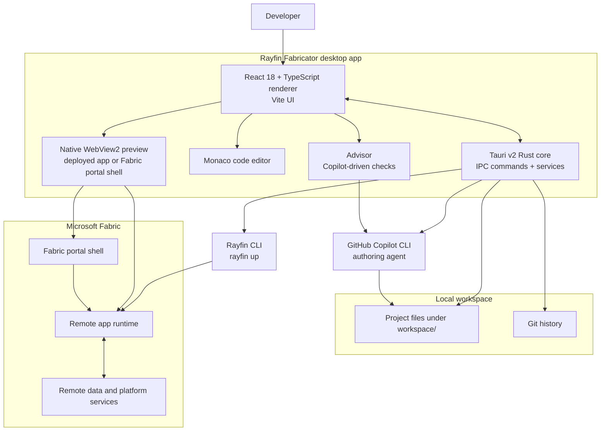
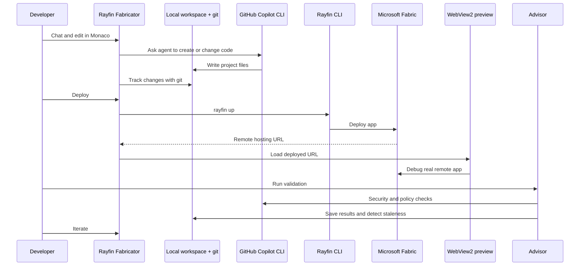

<div align="center">
  

  <h1>Rayfin Fabricator</h1>

  <p><strong>Build Rayfin apps through chat, deploy them to Microsoft Fabric, and debug the real remote runtime from your Windows desktop.</strong></p>

  <p>
    <a href="#install"></a>
  </p>

  <p>
    <a href="./LICENSE"></a>
    
    
    
    
  </p>
</div>

> **Personal project disclaimer**  
> This is a personal project built by Sachin Patney in his own free time. Although the author works at Microsoft, Rayfin Fabricator is not a Microsoft product — it is not affiliated with, endorsed by, sponsored by, or supported by Microsoft.

## What is Rayfin Fabricator?

**Rayfin Fabricator** is a Windows desktop app for building “Rayfin apps” through chat.

It combines a **Tauri v2 Rust backend**, a **React 18 + TypeScript renderer built with Vite**, a built-in Monaco editor, native WebView2 preview, git-backed project history, and two external CLIs:

- **GitHub Copilot CLI** — the AI authoring agent that writes and edits app code.
- **Rayfin CLI** — runs `rayfin up ...` to deploy apps to Microsoft Fabric.

The core workflow is simple:

> **author locally → deploy, preview, debug, and validate remotely**

## Install

Rayfin Fabricator is a **Windows 10/11** desktop app distributed as an NSIS installer.

> **[⬇️ Download the latest release](https://github.com/spatney/rayfin-fabricator/releases/latest)**

1. Grab the `Rayfin Fabricator_<version>_x64-setup.exe` asset (the `*-setup.exe` file) from the [latest release](https://github.com/spatney/rayfin-fabricator/releases/latest), or browse every build on the [Releases](https://github.com/spatney/rayfin-fabricator/releases) page.
2. Run the installer. The build is **not code-signed**, so Windows SmartScreen may warn you — choose **More info → Run anyway**.
3. Launch **Rayfin Fabricator**. The built-in onboarding doctor checks the remaining prerequisites (WebView2 runtime, the GitHub Copilot CLI) and walks you through signing in to GitHub Copilot and Microsoft Fabric.

To build apps you'll also create a Rayfin project with `npm create @microsoft/rayfin@latest` — Fabricator uses that project's pinned Rayfin CLI, so no global install is required.

Prefer to build from source instead? See [Getting started](#getting-started).

## Feature tour

- **Chat-driven app building** with the GitHub Copilot CLI under the hood, including threads and history.
- **Built-in Monaco code editor** for inspecting and editing generated project files.
- **Git controls** plus a history and restore view for local iteration.
- **One-click deploy to Microsoft Fabric** via the Rayfin CLI, with a deployments panel for create, switch, and redeploy flows.
- **Live embedded preview** of the deployed app in a native WebView2 surface.
- Preview tools for **navigation, reload, clear cookies / sign out, focus mode, Fabric portal shell toggle**, and **annotate screenshot → attach to chat**.
- **Skills view** for reusable capabilities.
- **Advisor tab** for Copilot-driven security and policy validation, with saved results and stale detection.
- **Onboarding doctor** that checks required tools and sign-in prerequisites.

## Architecture



The React renderer provides the workbench, chat, editor, preview, deployment controls, settings, skills, advisor, and history views. The Rust backend owns IPC handlers in `src-tauri/src/commands/` and services in `src-tauri/src/services/` for executing external tools, persistence, preview hosting, telemetry, history, crash logs, and path management.

Rayfin Fabricator shells out to the Copilot CLI for authoring and to the Rayfin CLI for deployment. The app source stays local, but the running app is the instance deployed to Microsoft Fabric and loaded into the embedded WebView2 preview.

## Local authoring, remote debug & validation



Rayfin Fabricator does **not** run your Rayfin app in a local dev server. You author files locally, then `rayfin up` deploys the project to Microsoft Fabric. The embedded preview loads the deployed remote hosting URL and can toggle into the Microsoft Fabric portal shell, so you debug the same instance users will run.

Validation is remote and AI-assisted: the Advisor uses Copilot-driven checks to flag issues such as routes not protected by auth or over-permissive database policies, then saves results and marks them stale when the project changes.

## Prerequisites

Rayfin Fabricator relies on these tools and sign-ins:

| Requirement | Notes |
| --- | --- |
| Windows 10/11 | WebView2 runtime required. |
| Node.js 20+ and npm | Required for the renderer and build scripts. |
| Rust stable with MSVC | Required only when building the desktop app from source. |
| Tauri prerequisites | Required for local desktop development and packaging. |
| Git | Used for local project history. |
| Rayfin CLI | Not required globally — it ships with each Rayfin project (`npm create @microsoft/rayfin@latest`); Fabricator runs the project-pinned version via `npx rayfin`. Sign in to Microsoft Fabric in-app. |
| GitHub Copilot CLI | Available as a command; sign in to GitHub Copilot. |

## Getting started

Clone the repository:

```powershell
git clone https://github.com/spatney/rayfin-fabricator.git
cd rayfin-fabricator
```

Install dependencies:

```powershell
npm install
```

Run the desktop app in development mode:

```powershell
npm run dev
```

Build the desktop app and NSIS installer:

```powershell
npm run build
```

External CLI setup and sign-ins are required to deploy and preview apps:

```powershell
npx rayfin --help
copilot --help
```

Useful scripts:

| Script | Description |
| --- | --- |
| `npm run dev` | Run the app in development mode with Tauri and Vite. |
| `npm run build` | Build the desktop app and installer. |
| `npm run dev:renderer` | Run the Vite renderer only. |
| `npm run build:renderer` | Build the Vite renderer only. |
| `npm run typecheck` | Type-check Node and web TypeScript projects. |
| `npm run lint` | Run ESLint. |
| `npm run format` | Format renderer source with Prettier. |

## Project layout

```text
rayfin-fabricator/
├─ src-tauri/                 Rust Tauri backend, IPC commands, services, resources, and packaging
│  ├─ src/commands/           IPC handlers for advisor, auth, chat, deploy, doctor, files, git, projects, settings, threads, and more
│  ├─ src/services/           exec, preview, store, telemetry, history, crashlog, emit, and paths services
│  └─ vendor/wry/             Vendored wry crate with WebView2 device-compliance SSO patch
├─ src/renderer/              React 18 + TypeScript UI built with Vite
│  ├─ screens/                SetupScreen onboarding and Workbench shell
│  └─ components/             ChatPanel, PreviewPane, CodeViewer, DeploymentsControl, AdvisorView, GitControl, SettingsModal, and more
├─ src/shared/ipc.ts          Shared TypeScript IPC types
├─ docs/                      Maintainer deployment notes and vendored wry patch documentation
├─ analytics/                 Application Insights KQL queries and notes
├─ resources/                 Runtime resources, including telemetry configuration placeholders
├─ .github/workflows/         Release workflow for NSIS installer builds
├─ package.json               npm scripts and renderer dependencies
└─ logo.png                   Project logo
```

The vendored `wry` patch is documented in [`docs/VENDORED-WRY-PATCH.md`](./docs/VENDORED-WRY-PATCH.md). It enables WebView2 device-compliance SSO so the embedded preview can sign in to Entra Conditional Access “compliant device” apps.

## Telemetry & privacy

Telemetry is optional and **off unless a connection string is present**.

- Official release builds can inject `resources/telemetry.json`.
- `resources/telemetry.example.json` is a zeroed placeholder.
- Local development builds send nothing by default.
- Events are intentionally coarse product signals such as `signin` and `deploy`.
- User and tenant identifiers are SHA-256 hashes of the email or email domain; raw emails are not sent.
- A salt ships in the binary and is explicitly **not** treated as a secret.

Maintainer provisioning details live in [`docs/DEPLOY.md`](./docs/DEPLOY.md).

## Contributing

Contributions are welcome. Please read [`CONTRIBUTING.md`](./CONTRIBUTING.md) and follow the project [`CODE_OF_CONDUCT.md`](./CODE_OF_CONDUCT.md).

## Security

Please report security issues according to [`SECURITY.md`](./SECURITY.md). Do not open public issues for sensitive reports.

## License

Rayfin Fabricator is released under the [MIT License](./LICENSE).

## Disclaimer

This is a personal project built by [Sachin Patney](https://github.com/spatney) in his own free time. Although the author works at Microsoft, Rayfin Fabricator is not a Microsoft product — it is not affiliated with, endorsed by, sponsored by, or supported by Microsoft.
