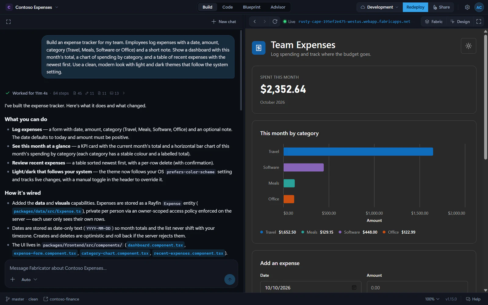

<div align="center">
  

  <h1>Fabricator</h1>

  <p><strong>The all-in-one workbench for building Rayfin apps — chat to build, preview inline, and ship to Microsoft Fabric, all in one window. No CLI wrangling, no new account: just your GitHub Copilot sign-in.</strong></p>

  <p>
    <a href="https://github.com/spatney/rayfin-fabricator/releases/latest"></a>
    <a href="https://spatney.github.io/rayfin-fabricator/docs"></a>
  </p>

  <p>
    <a href="./LICENSE"></a>
    
    
  </p>
</div>

<div align="center">
  <a href="https://spatney.github.io/rayfin-fabricator/">
    <picture>
      <source media="(prefers-color-scheme: dark)" srcset="./website/public/screenshots/workbench.webp" />
      <source media="(prefers-color-scheme: light)" srcset="./website/public/screenshots/workbench.light.webp" />
      
    </picture>
  </a>
  <p><sub>Build, preview, and ship — all in one window.</sub></p>
</div>

> **Personal project disclaimer**
> Fabricator is a personal project built by Sachin Patney in his own free time. The author works at Microsoft, but this is not a Microsoft product and is not affiliated with, endorsed by, sponsored by, or supported by Microsoft.

Building a Rayfin app usually means living in your terminal: scaffold with one CLI, prompt the Copilot CLI, run `rayfin up` to deploy, wrangle git, flip to a browser to check it, repeat. Fabricator folds all of that into a single desktop app.

You chat, the app gets built, you watch it come together inline, and you manage every deployment from one panel. It runs on the **GitHub Copilot account you already have** — nothing new to sign up for.

**📖 Documentation: [spatney.github.io/rayfin-fabricator](https://spatney.github.io/rayfin-fabricator/)** — installation, a first-app walkthrough, guides for every part of the app, team workspaces, and troubleshooting.

### New to Rayfin?

Rayfin is Microsoft's **Backend-as-a-Service for the agentic era**. You define your data model with TypeScript decorators and the platform provisions and manages the database, authentication, data APIs, storage, and hosting for you — all on Microsoft Fabric, with enterprise-grade governance built in. Learn more at [rayfin.ai](https://rayfin.ai) and [microsoft/rayfin](https://github.com/microsoft/rayfin).

## Everything in one window

1. **[Chat to build.](https://spatney.github.io/rayfin-fabricator/docs/build/chat)** Describe what you want in plain English. The built-in GitHub Copilot agent writes and edits the project files for you, and git quietly snapshots every change so you can diff and roll back.
2. **[See it as it's built.](https://spatney.github.io/rayfin-fabricator/docs/build/preview)** Watch the app in a live inline preview, point at anything in it with [Design mode](https://spatney.github.io/rayfin-fabricator/docs/build/design) to change it, and browse every file, its history and the data model.
3. **[Deploy with a click.](https://spatney.github.io/rayfin-fabricator/docs/ship/deploy)** Fabricator runs `rayfin up` for you, redeploys after each successful chat turn, and lets you [share the app](https://spatney.github.io/rayfin-fabricator/docs/ship/share) with people in your tenant.
4. **[Harden it.](https://spatney.github.io/rayfin-fabricator/docs/ship/advisor)** The Advisor grades your app's health with instant checks and an on-demand, read-only Copilot review, and every finding comes with a one-click fix.
5. **[Build with your team](https://spatney.github.io/rayfin-fabricator/docs/team)** *(experimental)*. Team workspaces keep your team's apps in a private GitHub repository, give everyone a personal preview, and publish to Fabric through a pipeline.

## Download

Fabricator runs on **Windows 10/11** and **macOS (Apple Silicon)**.

> **[⬇️ Download the latest release](https://github.com/spatney/rayfin-fabricator/releases/latest)**

- **Windows:** run `Rayfin Fabricator_<version>_x64-setup.exe`. It's code-signed; if SmartScreen still warns about a new release, choose **More info → Run anyway**.
- **macOS:** open `Rayfin Fabricator_<version>_aarch64.dmg` and drag the app into **Applications**. The build isn't notarized yet, so clear the quarantine flag once before opening it:

  ```bash
  xattr -dr com.apple.quarantine "/Applications/Rayfin Fabricator.app"
  ```

Then launch the app: setup checks your tools and signs you in to GitHub Copilot and the Azure CLI. The app keeps itself up to date. See the [install guide](https://spatney.github.io/rayfin-fabricator/docs/start/install) and [Build your first app](https://spatney.github.io/rayfin-fabricator/docs/start/first-app) for the full walkthrough.

## Documentation

| Start here | Guides | When something goes wrong |
| --- | --- | --- |
| [What is Fabricator?](https://spatney.github.io/rayfin-fabricator/docs) | [Chat with Copilot](https://spatney.github.io/rayfin-fabricator/docs/build/chat) | [Troubleshooting](https://spatney.github.io/rayfin-fabricator/docs/troubleshooting) |
| [Install Fabricator](https://spatney.github.io/rayfin-fabricator/docs/start/install) | [Deploy to Microsoft Fabric](https://spatney.github.io/rayfin-fabricator/docs/ship/deploy) | [Report a problem](https://spatney.github.io/rayfin-fabricator/docs/troubleshooting/report-a-problem) |
| [Set up and sign in](https://spatney.github.io/rayfin-fabricator/docs/start/setup) | [Check app health with the Advisor](https://spatney.github.io/rayfin-fabricator/docs/ship/advisor) | [FAQ](https://spatney.github.io/rayfin-fabricator/docs/reference/faq) |
| [Build your first app](https://spatney.github.io/rayfin-fabricator/docs/start/first-app) | [Team workspaces](https://spatney.github.io/rayfin-fabricator/docs/team) | [Privacy and telemetry](https://spatney.github.io/rayfin-fabricator/docs/reference/privacy) |

The site's source is in [`website/`](./website); every page has an **Edit this page** link.

## Build from source

You'll need Windows 10/11 or macOS, Node.js 20+, Rust stable (MSVC on Windows; Xcode command-line tools on macOS), the [Tauri prerequisites](https://v2.tauri.app/start/prerequisites/), and Git.

```bash
git clone https://github.com/spatney/rayfin-fabricator.git
cd rayfin-fabricator
npm install
npm run dev
```

`npm run build` builds the desktop app and its installer. See [`CONTRIBUTING.md`](./CONTRIBUTING.md) for scripts, the project layout, architecture, and how to work on the docs site.

## Telemetry & privacy

Telemetry is optional and stays off unless a connection string is built in; local development builds send nothing. Official releases send coarse usage events with a hashed email and your sign-in domain — never your code, prompts or apps. Details are in [Privacy and telemetry](https://spatney.github.io/rayfin-fabricator/docs/reference/privacy); maintainer provisioning lives in [`docs/DEPLOY.md`](./docs/DEPLOY.md).

## Contributing

Contributions are welcome. Read [`CONTRIBUTING.md`](./CONTRIBUTING.md) and follow the [`CODE_OF_CONDUCT.md`](./CODE_OF_CONDUCT.md).

## Security

Report security issues per [`SECURITY.md`](./SECURITY.md). Please don't open public issues for sensitive reports.

## License

Fabricator is released under the [MIT License](./LICENSE).

## Disclaimer

This is a personal project built by [Sachin Patney](https://github.com/spatney) in his own free time. The author works at Microsoft, but Fabricator is not a Microsoft product and is not affiliated with, endorsed by, sponsored by, or supported by Microsoft.
