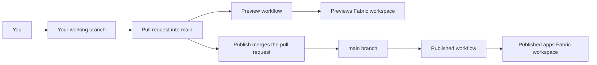

> [!WARNING]
> Team workspaces are an experiment. Turn them on in **Settings → Experiments**. They may change or be removed in a future update.

Team workspaces let several people build Rayfin apps together without sharing one laptop or one deployment. Fabricator keeps the team's apps in GitHub, gives each person a working copy and a personal preview, and publishes the shared app through a GitHub Actions pipeline.

## How a team workspace works

A team workspace is one private GitHub repository. Each top-level folder that contains `rayfin/rayfin.yml` is one Rayfin app.

Fabricator also creates two Microsoft Fabric workspaces:

- one workspace for published apps that everyone uses
- one workspace for everyone's personal previews

The repository pipeline signs in to Microsoft Fabric with Microsoft Entra ID service principals called deploy identities. It uses GitHub OIDC, so Fabricator stores IDs as GitHub Actions variables but stores no client secrets.

Pull requests can only use the preview identity. Pushes to `main` use the deploy identity for published apps. That means a pipeline change in a pull request cannot touch the published apps workspace.

## Turn on the experiment

1. Open **Settings**.
2. Open **Experiments**.
3. Turn on **Team workspaces**.
4. Make sure the GitHub CLI `gh` is installed. Fabricator uses it for team repositories.

Turning the experiment off hides team workspaces and team apps in Fabricator. It does not delete the GitHub repository, Fabric workspaces, apps, deploy identities, or local files.

## What to read next

<Cards>
  <Card title="Before you start" href="/docs/team/prerequisites">Check GitHub, Azure, Fabric, and Rayfin requirements.</Card>
  <Card title="Create a team workspace" href="/docs/team/create">Set up the repository, Fabric workspaces, identities, and pipeline.</Card>
  <Card title="Invite your team" href="/docs/team/members">Invite teammates and give them Fabric app access.</Card>
  <Card title="Work on a team app" href="/docs/team/work-on-an-app">Open an app, preview changes, and bring in teammates' work.</Card>
  <Card title="Publish changes" href="/docs/team/publish">Merge your work and deploy the published app.</Card>
  <Card title="Use the workspace overview" href="/docs/team/overview">See apps, previews, published deployments, data, and pipeline activity.</Card>
  <Card title="Move an existing app" href="/docs/team/move-an-app">Copy a local project into a team workspace.</Card>
  <Card title="Information for administrators" href="/docs/team/administrators">Review the Entra, Fabric, GitHub, and workflow details.</Card>
  <Card title="Team workspace limitations" href="/docs/team/limitations">Understand current limits before relying on the experiment.</Card>
</Cards>
